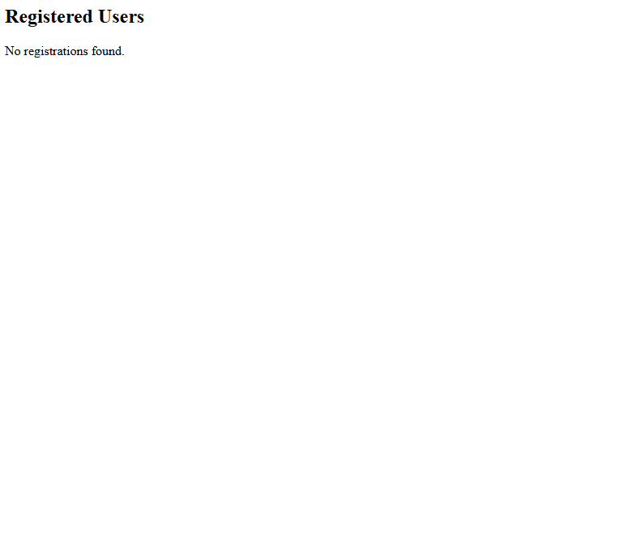

# Serverless Event Management System

## **Project Overview**

This project is a **fully serverless** event management system built on AWS. It enables users to register for events, receive notifications, and manage event data efficiently. The system integrates multiple AWS services, ensuring scalability, reliability, and cost-effectiveness.

## **Architecture**

The system is divided into multiple components, each handling a specific function. Below is an overview of the architecture:

```
project-folder/
│── lambdas/             # AWS Lambda functions (Python)
│── api-gateway/         # API Gateway configurations (Swagger/OpenAPI)
│── database/            # SQL script for RDS database setup
│── admin-panel/         # PHP files for managing events/admin access
│── frontend/            # Frontend files (HTML, CSS, JS, stored in S3)
│── README.md            # Project documentation
```

### **Key AWS Services Used**

- **Amazon S3** – Hosts the static frontend files.
- **API Gateway** – Exposes the backend APIs to handle user requests.
- **AWS Lambda** – Handles backend logic and processes event registrations.
- **DynamoDB** – Stores user registration details.
- **Amazon RDS** – Stores event details and user data.
- **Amazon SQS** – Queues messages for event processing.
- **Amazon SNS** – Sends notifications to users.
- **IAM & KMS** – Ensures security and access control.
- **CloudWatch & CloudTrail** – Monitors and logs activities for debugging.

## **Features**

✅ **Serverless architecture:** No need to manage infrastructure.
✅ **Scalable backend:** Can handle a large number of event registrations.
✅ **Automated notifications:** Users receive event updates via email/SMS.
✅ **Admin panel:** PHP-based admin panel to manage events.
✅ **Secure storage:** Uses IAM roles and KMS for security.

---

## **Deployment Instructions**

### **1. Deploying the Frontend (Amazon S3)**

1. Upload the `frontend/` files to an S3 bucket.
2. Enable static website hosting in S3 settings.
3. Set the **bucket policy** to allow public read access.
4. Get the website URL from the S3 console.


### Frontend (S3 Hosted)


### Frontend After User Registration (S3 Hosted)


### **2. Setting Up API Gateway**

1. Navigate to **API Gateway** in the AWS Console.
2. Create a new **REST API** and import the Swagger file from `api-gateway/`.
3. Deploy the API and note the generated URL.


### API Gateway Setup


### Invoke URL


### **3. Deploying Lambda Functions**

1. Zip the `lambdas/` folder.
2. Upload the ZIP files in **AWS Lambda**.
3. Attach necessary **IAM roles** for database access.


### Lambda Triggers


### Lambda Triggers


### Lambda Execution Logs


### Lambda Execution Logs for SQS Queue


### **4. Configuring DynamoDB & RDS**

1. Navigate to **DynamoDB** and create a table for user registrations.
2. Navigate to **RDS** and run the SQL script from `database/`.
3. Note down the database endpoint.


### RDS Database Query


### DynamoDB Table Before Event


### DynamoDB Table


### **5. Setting Up Admin Panel (PHP on EC2)**

1. Launch an **EC2 instance** with Apache & PHP installed.
2. Copy the `admin-panel/` files to `/var/www/html/`.
3. Update the database credentials in `admin.php`.
4. Restart Apache: `sudo systemctl restart httpd`.


### Admin Panel Before Registration


### Admin Panel After Registration


### Lambda Execution Logs


### **6. Configuring Notifications (SNS & SQS)**

1. Create an **SNS topic** for event notifications.
2. Subscribe users to receive event updates.
3. Create an **SQS queue** for processing event-related messages.


### Lambda Execution Logs for SQS Queue


---


## **How Everything Connects**

- The **frontend (S3)** interacts with **API Gateway**, which triggers **Lambda** functions.
- **Lambda** processes event registrations, storing user data in **DynamoDB** and event details in **RDS**.
- **SQS** queues event processing tasks, while **SNS** sends notifications.
- **CloudWatch** provide monitoring and logging.
- The **Admin Panel (PHP on EC2)** provides a web interface for event management.
- **IAM** provides access and permission to the needed systems.


### Project Architecture


---

## **Future Improvements**

🔹 **User authentication:** Implement AWS Cognito for secure logins.
🔹 **GraphQL API:** Upgrade from REST to GraphQL for efficient data fetching.
🔹 **Auto-scaling database:** Implement Aurora Serverless instead of standard RDS.
🔹 **Caching:** Use AWS ElastiCache (Redis) to improve performance.
🔹 **CloudWatch Logs** for API Gateway.
🔹 **CloudTrail** to track AWS API actions.
🔹 **Alarms** to monitor system health.

---

## **Conclusion**

This project demonstrates the power of **serverless architecture** on AWS. It efficiently handles event registrations, notifications, and management using a combination of AWS services. 🚀

---

### **Need Help?**

If you encounter any issues, feel free to create a GitHub issue or contact me.
